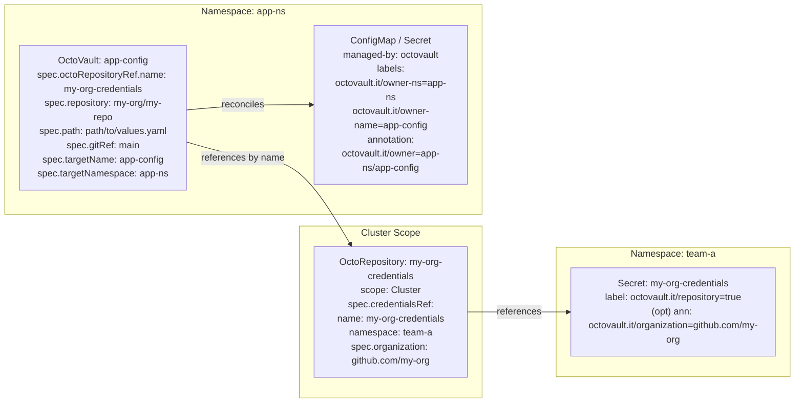
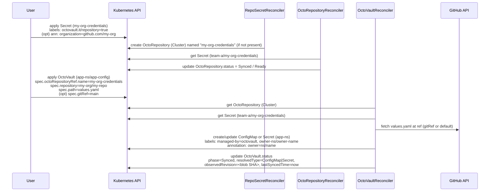

# OctoVault


OctoVault is a Kubernetes operator that pulls config/secrets from **GitHub** (per repo + path, on an optional **git ref**) and materializes them as native **ConfigMaps** or **Secrets**.  
It also supports external secret sources referenced from your Git-backed `values.yaml`:
- **Key Value** pairs
- **AWS Secrets Manager** (JSON key extraction, stage-aware, cached)
- **AWS Systems Manager Parameter Store** (String/SecureString/StringList, JSON key extraction, cached)

- **CRDs**
    - `OctoRepository` **(cluster-scoped)** — stores GitHub owner/organization and a reference to a namespaced credentials `Secret`. Any namespace can reuse it.
    - `OctoVault` **(namespaced)** — points at a repo/path (and optional `gitRef`), validates & applies data into a target `ConfigMap`/`Secret`.

- **Status you can trust**: `Phase` (`Pending`/`Synced`/`Failed`), `ObservedRevision` (blob SHA of `values.yaml`; commit SHA with `GIT_REVISION_FROM_COMMIT=true`), `ResolvedType` (`ConfigMap|Secret`), `AppliedDataHash`, `LastSyncedTime`, and a `Ready` condition.

---

## How it works

1. Create a **GitHub credentials Secret** (PAT) in some namespace (e.g., `octovault-system`, `my-app`).
2. Create a **cluster-scoped** `OctoRepository` pointing at `github.com/<owner>` and referencing that Secret **with namespace+name**.
3. In your workload namespace, create an **OctoVault** referencing the `OctoRepository` by name, plus `repository`, `path` to `values.yaml`, and optional `gitRef` (branch/tag/SHA).
4. The operator:
    - fetches `values.yaml` via GitHub API (one request per poll, conditional via `ETag`),
    - **optionally** pulls individual keys from **AWS Secrets Manager** (`type: AwsSecretManager`) or **AWS SSM Parameter Store** (`type: AwsParameterStore`),
    - validates and applies as a **ConfigMap** or **Secret**,
    - records status and emits Events.

It keeps the target resource in sync on a timer (`spec.pollInterval`).

Polling is designed to stay well inside GitHub's PAT rate limit: each poll issues a
single `contents` request, sent as a conditional request with `If-None-Match`. GitHub
does not count `304 Not Modified` responses against the primary rate limit, so an
unchanged `values.yaml` costs nothing. See [Rate limits](#rate-limits).

###


```mermaid
%% Reference map: how OctoVault and OctoRepository relate

graph LR
  subgraph NS_X["Namespace: team-a"]
    S["Secret: my-org-credentials<br/>label: octovault.it/repository=true<br/>(opt) ann: octovault.it/organization=github.com/my-org"]
  end

  subgraph Cluster["Cluster Scope"]
    OR["OctoRepository: my-org-credentials<br/>scope: Cluster<br/>spec.credentialsRef:<br/>name: my-org-credentials<br/>namespace: team-a<br/>spec.organization: github.com/my-org"]
  end

  subgraph NS_Y["Namespace: app-ns"]
    OV["OctoVault: app-config<br/>spec.octoRepositoryRef.name: my-org-credentials<br/>spec.repository: my-org/my-repo<br/>spec.path: path/to/values.yaml<br/>spec.gitRef: main<br/>spec.targetName: app-config<br/>spec.targetNamespace: app-ns"]
    CM["ConfigMap / Secret<br/>managed-by: octovault<br/>labels:<br/>octovault.it/owner-ns=app-ns<br/>octovault.it/owner-name=app-config<br/>annotation:<br/>octovault.it/owner=app-ns/app-config"]
  end

  OR -- references --> S
  OV -- references by name --> OR
  OV -- reconciles --> CM
```


```mermaid
%% Reconciliation flow from create to applied output

sequenceDiagram
  participant U as User
  participant API as Kubernetes API
  participant RS as RepoSecretReconciler
  participant ORC as OctoRepositoryReconciler
  participant OVC as OctoVaultReconciler
  participant GH as GitHub API

  U->>API: apply Secret (my-org-credentials)<br/>labels: octovault.it/repository=true<br/>(opt) ann: organization=github.com/my-org
  RS->>API: create OctoRepository (Cluster) named "my-org-credentials" (if not present)
  ORC->>API: get Secret (team-a/my-org-credentials)
  ORC->>API: update OctoRepository.status = Synced / Ready

  U->>API: apply OctoVault (app-ns/app-config)<br/>spec.octoRepositoryRef.name=my-org-credentials<br/>spec.repository=my-org/my-repo<br/>spec.path=values.yaml<br/>(opt) spec.gitRef=main
  OVC->>API: get OctoRepository (Cluster)
  OVC->>API: get Secret (team-a/my-org-credentials)
  OVC->>GH: fetch values.yaml at ref (gitRef or default)
  OVC->>API: create/update ConfigMap or Secret (app-ns)<br/>labels: managed-by=octovault, owner-ns/owner-name<br/>annotation: owner=ns/name
  OVC->>API: update OctoVault.status<br/>phase=Synced, resolvedType=ConfigMap|Secret,<br/>observedRevision=<blob SHA>, lastSyncedTime=now
```

---

## CRDs

### OctoRepository (cluster-scoped)

One per GitHub owner/org for the whole cluster. Credentials live in a namespaced `Secret`; the `OctoRepository` is cluster-scoped so any namespace can reuse it.

Example:
```yaml
apiVersion: octovault.it/v1alpha1
kind: OctoRepository
metadata:
  name: my-org
spec:
  organization: "github.com/my-org"
  credentialsRef:
    namespace: octovault-system
    name: my-org-credentials
```
Credentials `Secret`:
```yaml
apiVersion: v1
kind: Secret
metadata:
  name: my-org-credentials
  namespace: octovault-system
type: Opaque
stringData:
  username: "octovault"            # optional (defaults to "octovault")
  password: "<GITHUB_PAT>"         # required
  # passwordEncoding: base64     # optional, if password is base64 text
```

- Label: `octovault.it/repository: "true"`
- Organization: `octovault.it/organization: github.com/my-org` (or `data.organization`)

### OctoVault (namespaced)

Fetches and applies one `values.yaml` as a `ConfigMap` or `Secret` in the **same** (or specified) namespace.
```yaml
apiVersion: octovault.it/v1alpha1
kind: OctoVault
metadata:
  name: app-config
  namespace: demo
spec:
  octoRepositoryRef:
    name: my-org                      # cluster-scoped OctoRepository
  repository: "my-org/my-repo"        # owner/repo
  path: "config/environments/prod.yaml"
  gitRef: "release-2025-09"           # optional (branch/tag/SHA)
  targetName: "app-config"            # ConfigMap/Secret name
  targetNamespace: "demo"             # optional (defaults to this namespace)
  pollInterval: "5m"                  # Go duration (default 5m)
```
Status (abbrev.):
```yaml
status:
  phase: Synced
  # blob SHA of values.yaml — changes iff the file content changes.
  # Set GIT_REVISION_FROM_COMMIT=true to record the commit SHA instead
  # (costs one extra GitHub request per poll).
  observedRevision: 5b32c1f...
  resolvedType: ConfigMap
  appliedDataHash: 4a8d...
  lastSyncedTime: 2025-09-01T03:20:10Z
  conditions:
    - type: Ready
      status: "True"
      reason: "Synced"
      message: "values applied"
```
### `values.yaml` format

#### ConfigMap
```yaml
metadata:
  type: ConfigMap
  annotations:
    foo: bar
  labels:
    john: doe
spec:
  data:
    - key: FOO
      value: "bar"
```
- If `metadata.type` is `ConfigMap`, values become `.data[string]`.
- Only `Text` (default) type is supported.
- **OctoVault owns the labels and annotations of the resource it creates.** System keys are always preserved even if they are not declared in `values.yaml`. For user/third-party `metadata.labels` and `metadata.annotations`, only keys declared in `values.yaml` are retained; any undeclared keys are removed on every reconcile.

#### Secret
```yaml
metadata:
  type: Secret
  annotations:
    foo: bar
  labels:
    john: doe
spec:
  data:
    - key: FOO
      value: "bar"                  # type omitted → Text
      # type: Text

    - key: SM_FOO
      type: AwsSecretManager        # pull from AWS Secrets Manager
      name: "prod/app/token"        # secret id/name/arn acceptable
      jsonKey: "foo.bar"            # optional dot-path into JSON. Omit for whole value.

    - key: PS_FOO                   # from AWS SSM Parameter Store
      type: AwsParameterStore
      name: "/prod/app/param"       # parameter name (supporting path-style)
      withDecryption: true          # set true for SecureString
      jsonKey: "nested.key"         # optional dot-path into JSON. Omit for whole value.
```

- If `metadata.type` is `Secret`, values become `.data[bytes]` (`Opaque`).
- Only Secret types `Text` (default), `AwsSecretManager`, and `AwsParameterStore` are supported.

> Notes
>
> **AwsSecretManager**
> 
> -	Auth via your controller ServiceAccount (IRSA/web-identity/etc.).
> 
> -	jsonKey extracts a nested field from a JSON SecretString; non-string nodes are serialized to JSON.
> 
> -	The provider surfaces VersionId and VersionStages internally and caches results with a TTL.
> 
> **AwsParameterStore**
> 
> - Supports String, SecureString, and StringList.
> 
> -	Use withDecryption: true when the type is SecureString.
> 
> -	If the parameter value is JSON, you may extract a field via jsonKey. Non-string nodes are serialized to JSON.
> 
> -	StringList is returned as-is (comma-separated); OctoVault does not split it automatically.
>

---

## Install

### Helm

The chart (`charts/octovault-operator`) includes CRDs in its `crds/` folder; Helm will install them automatically (Helm ≥3.2).

```
helm upgrade --install --create-namespace --namespace=octovault-system \
  --values values.yaml octovault-system oci://ghcr.io/octovault/octovault
```

Common values:
```yaml
image:
  repository: ghcr.io/octovault/octovault
  tag: v0.0.1
controller:
  probes:
    healthz: ":8081"
  metrics:
    enabled: true
    secure: true
    port: 8443
  enableHTTP2: false
  env:
    GIT_CRED_TTL: "10m"  # PAT verification cache TTL / OctoRepository recheck period
    GIT_API_URL: ""      # default https://api.github.com
    GIT_REF: ""          # global default ref (fallback)
    GIT_REVISION_FROM_COMMIT: "false"  # true adds one /commits request per poll
    AWS_REGION: ""       # empty → AWS SDK default chain (IRSA)
    AWS_SM_TTL: "3m"     # AWS SM cache TTL. Default 1m
    AWS_PS_TTL: "3m"     # AWS Parameter Store cache TTL. Default 1m
```
### Manual CRDs

If you prefer manual steps:
```bash
kubectl apply -f config/crd/bases/      # CRDs
# then deploy controller manifests or Helm
```
---

## Configuration & environment

| Env var                      | Purpose                                                       | Default                  |
|------------------------------|---------------------------------------------------------------|--------------------------|
| `GIT_CRED_TTL`           | How long a PAT access check is trusted, and the `OctoRepository` recheck period. At most one GitHub probe per period. | `10m`                    |
| `GIT_API_URL`            | GitHub API base (`https://api.github.com` or GHES URL)        | `https://api.github.com` |
| `GIT_REF`                | **Global** default git ref if `OctoVault.spec.gitRef` is empty | *(none)*                 |
| `GIT_REVISION_FROM_COMMIT` | Record `observedRevision` as the latest commit SHA. Costs **one extra request per poll**; when `false`, the blob SHA from the `contents` response is used instead. | `false`                  |
| `GIT_SCHEMA_FILE`        | Schema file to fetch alongside `values.yaml`. Empty disables the request. Only useful once a validator is wired in — otherwise the response is fetched and discarded. | *(none)*                 |
| `AWS_REGION`             | Region override for AWS SM (empty → SDK default/IRSA)         | *(auto)*                 |
| `AWS_SM_TTL`             | AWS SM cache TTL (Go duration)                                | `1m`                     |
| `AWS_PS_TTL`             | AWS Parameter Store cache TTL (Go duration)                   | `1m`                     |

---

## Rate limits

A GitHub PAT is limited to **5,000 REST requests per hour**, and every `OctoVault`
referencing the same `OctoRepository` shares that single budget. Requests that return
`404` count against it; only `304 Not Modified` responses from conditional requests do not.

**Request accounting per poll**

| Source | Requests | Notes |
|---|---|---|
| `OctoVault` — fetch `values.yaml` | 1 | `0` charged when unchanged (`304` via `If-None-Match`) |
| `OctoVault` — schema file | 0 | Only when `GIT_SCHEMA_FILE` is set |
| `OctoVault` — commit revision | 0 | Only when `GIT_REVISION_FROM_COMMIT=true` |
| `OctoRepository` — PAT access probe | ≤1 per `GIT_CRED_TTL` | Cached; `2` on the first check of a personal (non-org) account |

At the defaults (`pollInterval: 5m`, `GIT_CRED_TTL: 10m`), a single `OctoVault` costs
**at most 12 requests/hour**, and effectively far fewer once `values.yaml` stops changing.

**When a limit is hit**

The controller reads `X-RateLimit-Remaining`, `X-RateLimit-Reset` and `Retry-After`,
distinguishes a primary limit from a secondary one, and requeues only after the reported
reset instead of continuing to poll. Status moves to `Failed` with reason `RateLimited`
(distinct from `AccessDenied`, which means the token genuinely lacks access).

**If you still exhaust the limit**, in order of effect:

1. Raise `spec.pollInterval` — cost scales linearly with it.
2. Keep `GIT_REVISION_FROM_COMMIT=false` and `GIT_SCHEMA_FILE` unset (both are defaults).
3. Raise `GIT_CRED_TTL`.
4. Split `OctoVault` resources across several `OctoRepository` objects with different PATs —
   the limit is per token, so this multiplies the available budget.
5. Consider a GitHub App installation token (15,000/hour) instead of a PAT.

---

## Permissions & security

- **GitHub PAT** in a K8s `Secret`.
    - Scopes:
        - public repos only → PAT optional,
        - private repo read → `repo`,
        - sometimes `read:org` as org policy requires.
- **AWS SM** via IRSA/web-identity. Grant `secretsmanager:GetSecretValue` for referenced secrets.
- **AWS PS** via IRSA/web-identity. Grant `secretsmanager:GetParameter` for referenced values.
- Operator writes into the target namespace and sets `ownerReferences` to the `OctoVault` for GC.

---

## Observability

- Conditions and rich Status on both CRDs.
- Kubernetes Events for error/success paths.
- Prometheus metrics endpoint (HTTP/HTTPS) with optional authz.

### GitHub rate-limit metrics

| Metric | Type | Meaning |
|---|---|---|
| `octovault_github_rate_limit_remaining{resource,credential}` | gauge | `X-RateLimit-Remaining` as last seen, per credential fingerprint |
| `octovault_github_rate_limit_total{resource,credential}` | gauge | `X-RateLimit-Limit` |
| `octovault_github_rate_limit_reset_timestamp_seconds{resource,credential}` | gauge | Unix time at which the window resets |
| `octovault_github_requests_total{kind,code}` | counter | Requests issued, by endpoint kind and status code |
| `octovault_github_conditional_hits_total{kind}` | counter | `304` responses — these do **not** consume rate limit |
| `octovault_github_rate_limited_total{kind}` | counter | Requests rejected by a primary or secondary rate limit |
| `octovault_github_credential_check_cache_total{result}` | counter | PAT verification cache `hit`/`miss` |

`credential` is a short non-reversible fingerprint of the token, never the token itself.

A healthy deployment shows `conditional_hits_total` growing at roughly the same rate as
`requests_total`, and `rate_limit_remaining` staying flat. Alert on
`octovault_github_rate_limit_remaining` dropping toward zero, or on any increase in
`octovault_github_rate_limited_total`.

---

## Development

Repo layout:

    api/v1alpha1/                 # CRD Go types
    internal/controller/          # reconcilers
    internal/github/              # GitHub fetcher
    internal/awssm/               # AWS Secrets Manager provider
    charts/octovault-operator/    # Helm chart (includes CRDs)

Make targets:

    make manifests     # generate CRDs/RBAC
    make generate      # deepcopy, etc.
    make build         # manager binary
    make run           # run locally against current kubeconfig
    make test          # unit tests via envtest
    make build-installer

Tests cover controllers (`OctoVault`, `OctoRepository`), the GitHub fetcher (content + commit APIs, path/encoding, ref pinning), and the AWS SM provider (jsonKey extraction, caching, error mapping).

---

## Contributing

Issues and PRs are welcome. Please run `make lint` and `make test` before opening a PR. For larger changes, open an issue to discuss design/UX first.

### dev-whoan [](https://www.buymeacoffee.com/dev.whoan)

- [GitHub](https://github.com/dev-whoan)

---
